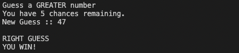
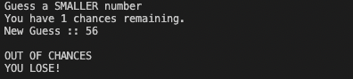

# number-guesser

## How to Play

1. Guess a number between 1 to 100.
2. The program will tell you if the number is greater or smaller.
3. Enter new guess. 

You will have 10 chances to guess it right.

**Win Message:**

**Lose Message:**

### Installation & Setup:

The Project runs on and above dotnet version 6.0.202

Type `dotnet --version` in terminal to check if you have dotnet installed and the version number.

If you don't have dotnet installed, you can download it [here](https://docs.microsoft.com/en-us/dotnet/core/install/windows?tabs=net60).

If you have homebrew installed in mac, use this command to install from terminal:
brew install --cask dotnet-sdk

### How to Run:

Go to the project directory in terminal and enter `dotnet run`

### What I learned:

 - :white_check_mark: 06/07/2022
1. Creating a fork
2. Creating a branch
3. Commiting changes
4. Creating Pull Request 

- :white_check_mark: 06/08/2022
1.  Creating a branch from CLI
2.  Commiting changes from CLI
3.  Pushing from CLI
4.  Fetching Upstream from CLI
5.  Generating a random number in C#

- [ ] 06/09/2022

### Issues Faced:

None

### Additional Notes:

1.  Random class was used to make an object and get a random number from 1 to 100.

### Evaluation:
- Great job! 
- Score: 10/10